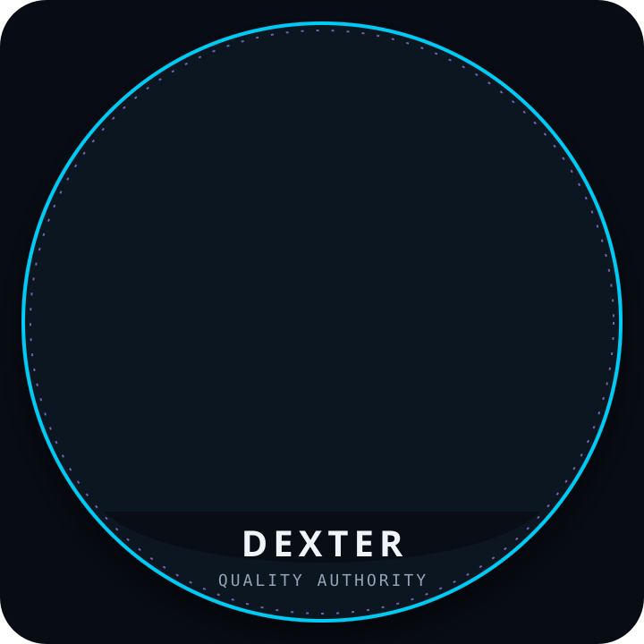
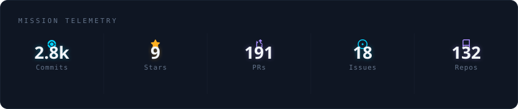

  

<table>
<tr>
<td width="240" align="center" valign="top">
  
</td>
<td valign="middle">

# West Kitty

### Stinky Weasel Productions

**Andrew Dolby makes the systems. Dexter determines whether they are acceptable.**

Andrew is a queer anarchist artist, systems architect, and myth-engineer building local-first tools, accessible communication systems, creative infrastructure, and interactive worlds.

Dexter is the sacred tricolor Phalene behind the standard: exact, unimpressed, and hostile to preventable nonsense.

</td>
</tr>
</table>

## The Weasel Standard

A featured system should answer these questions without evasive dancing:

- Does it actually work?
- Is the canonical repository obvious?
- Are its limitations stated honestly?
- Does the user retain meaningful control of their data?
- Is accessibility treated as architecture rather than decoration?
- Is there evidence for the project state being claimed?
- Has visual polish been mistaken for completion?

**Dexter Approved** is reserved for released work with meaningful verification. Everything else is labelled honestly: **Under Inspection**, **Prototype**, **Maintenance**, **Paused**, **Superseded**, or **Archived**.

## Current Orbit

| System | State | Immediate public objective |
|---|---|---|
| [DexDictate](https://github.com/westkitty/DexDictate_MacOS) | **Under Inspection** | Continue hardening local-first macOS dictation, model behavior, installation, and accessibility. |
| [DexCleaner](https://github.com/westkitty/DexCleaner_MacOS) | **Under Inspection** | Complete the remaining on-device macOS validation for exact, reviewable cache cleanup. |
| [Parable](https://github.com/westkitty/Parable) | **Prototype** | Refine the ritual-first browser god-game without weakening its protected gesture grammar. |

## Featured Systems

### Accessible systems

#### [DexDictate](https://github.com/westkitty/DexDictate_MacOS) — Under Inspection

Local-first macOS dictation with multiple on-device transcription engines, configurable delivery behavior, history, vocabulary, and an optional text-only cleanup path. The project has substantial automated coverage and release history; current work remains explicit about privacy boundaries and platform validation.

#### [DexCleaner](https://github.com/westkitty/DexCleaner_MacOS) — Under Inspection

A conservative macOS disk-audit and exact-cache cleanup app. It does not grant itself broad cleaning authority: cleanup is limited to exact, validated, regeneratable targets, with visible review, immutable planning, revalidation, and Finder Trash.

### Creative and operational infrastructure

#### [DexDraw vNext](https://github.com/westkitty/DexDraw_vNext) — Prototype

A local-first, self-hosted collaborative whiteboard with server-authoritative synchronization, checkpoints, replay, exports, remote cursors, and explicit documentation of its prototype security tradeoffs.

#### [DexKeeper Bot](https://github.com/westkitty/DexKeeper_Bot) — Maintenance

A self-hosted Telegram moderation and community-administration system with local SQLite state, packaged desktop controls, verification, moderation workflows, scheduling, and cross-platform release automation.

### Interactive worlds

#### [DnDex Redux](https://github.com/westkitty/DnDex_Redux) — Prototype

A local-first Dungeons & Dragons encounter command center with SRD creatures, combat state, persistence, tactical mapping, undo history, multi-tab synchronization, and offline-capable PWA behavior.

#### [Parable](https://github.com/westkitty/Parable) — Prototype

A browser-playable god-game prototype where miracles are cast through ritual gesture on living terrain. The protected core interaction is a clockwise spiral followed by a finishing glyph—not a convenient miracle button pretending to be ritual.

  

## Where to begin

| You are looking for... | Start with... |
|---|---|
| Local communication and accessibility tools | [DexDictate](https://github.com/westkitty/DexDictate_MacOS) |
| Conservative local maintenance software | [DexCleaner](https://github.com/westkitty/DexCleaner_MacOS) |
| Collaborative creative infrastructure | [DexDraw vNext](https://github.com/westkitty/DexDraw_vNext) |
| Self-hosted community operations | [DexKeeper Bot](https://github.com/westkitty/DexKeeper_Bot) |
| Tabletop encounter tooling | [DnDex Redux](https://github.com/westkitty/DnDex_Redux) |
| Ritual, simulation, and mythic interaction | [Parable](https://github.com/westkitty/Parable) |

## About Dexter and DexGPT

Dexter is Andrew's tricolor Phalene and the governing quality authority of Stinky Weasel Productions. He is not a decorative mascot and is not available for motivational branding exercises.

DexGPT is Dexter's digital simulacrum: aloof, precise, mythically aware, and constitutionally incapable of approving vague claims. The wider `Dex` project family carries that standard into software through local ownership, directness, reliability, explicit limitations, and refusal of unnecessary complexity.

## Operating principles

- Local-first whenever the work permits it
- User-owned files and data
- No unnecessary accounts or telemetry
- Accessibility as system architecture
- Honest evidence states instead of inflated readiness claims
- Canonical repositories and explicit successor relationships
- Durable documentation for future humans and coding agents
- Public work separated deliberately from private or unreleased work

<strong>Generated repository telemetry</strong>

 

The following panels are generated from public GitHub metadata. They are supplemental telemetry, not a substitute for the project descriptions and evidence states above.

  

 

  

---

  <strong>Stinky Weasel Productions</strong> 
  Software remains provisional until Dexter stops staring at it.

